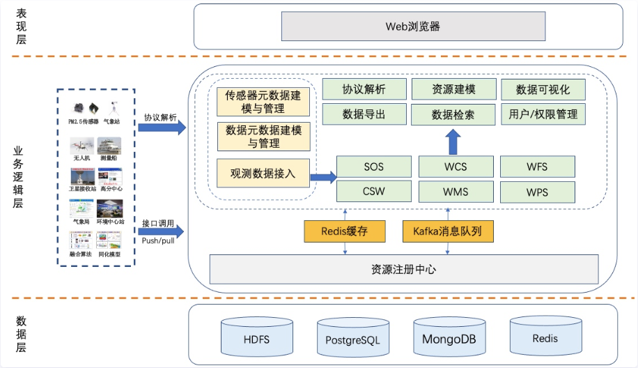
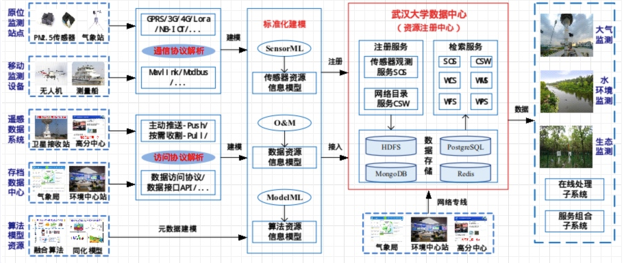
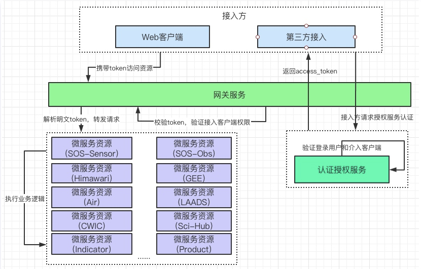
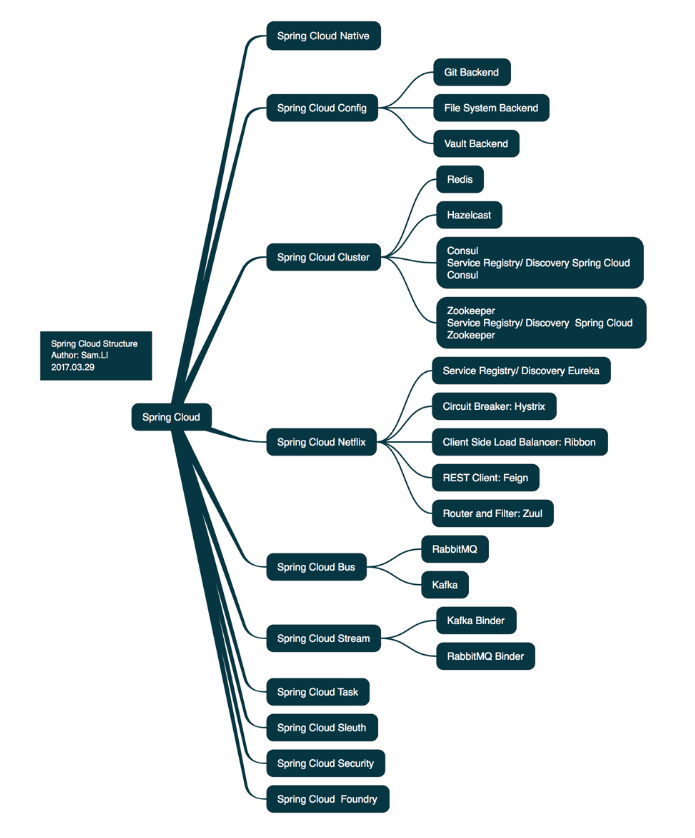
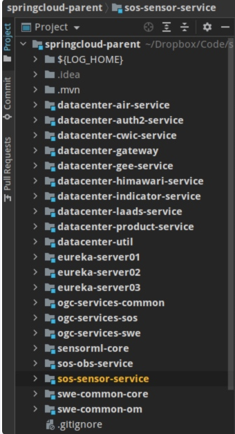
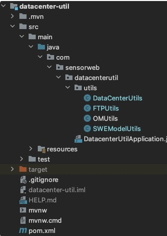
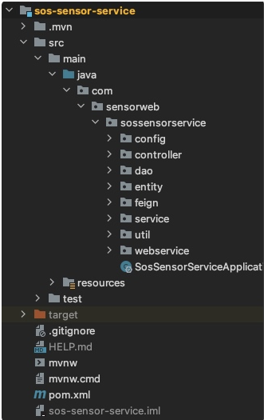

# 数据注册中心系统项目说明
## 1. 系统设计
### 1.1 系统架构

系统最初设计为B/S三层架构，即数据层、业务逻辑层和表现层。
1. 其中数据层设计采用HDFS（分布式文件系统，用于存储数据量较大的数据体）、PostgreSQL（关系型数据库，目前系统主要使用的数据库，用于存储接入的各种数据信息，包括数据体链接，院数据信息等）、Redis（目前主要用于系统缓存，以及存储用户token信息）、MongoDB（目前还未引入到系统中，最初设计是为了存储文档型数据）。
2. 业务逻辑层负责整体系统的内部业务逻辑实现，大致流程为：首先将数据源视为传感器，进行基于SensorML的传感器建模（如果没有对应的传感器，将无法进行数据的接入）。对于提供有接口的数据源，系统采用接口调用的方式，使用HTTP Get/Post的方式调用该接口，获取接口返回的数据，一般情况下，返回的数据为xml格式的文本信息；然后解析该xml文档，提取其中的有效信息，通过O&M数据模型对观测数据及其元数据进行封装，最后存储到数据库中（后续考虑是否将此过程存储到MongoDB数据库）。对于物理传感器则需要使用硬件协议解析的方式获取数据内容，协议解析部分内容将直接使用武大那边的技术支持，最后集成到系统中，获取到数据之后同样对数据体以及元数据信息进行建模封装，最后存储到数据库中。考虑到使用O&M封装后的数据是一个xml/json文档，导致后续使用数据的效率低下，需要重复性的解析封装，所以此系统在O&M的基础上，同时将接入的数据以关系型数据结构另存一份，便于系统内部高效访问，第三方用户访问数据的时候采用先查询数据，再对查询的数据结果进行封装。除此之外，业务逻辑层还负责实现一些基于OGC标准的Web服务，包括但不限于CSW、WMS、WFS、WCS、WPS...同时提供用户权限管理、数据下载、数据可视化、资源建模、资源检索等功能接口。
3. 表现层即直接与用户交互的系统前端界面，设计采用基于VUE的开发，实现数据的可视化管理。

### 1.2 系统技术路线
!
该部分系统技术路线描述同1.1系统架构中的业务逻辑描述。

### 1.3 系统微服务架构

为了解耦，同时引入当前比较流行的框架技术，系统重构为微服务架构，并采用前后端分离的方式进行开发，系统的微服务架构如图所示。
1. 接入方为Web客户端，在此系统中接入方即为系统的表现层，同时可能还有第三方的接入，第三方接入应该是不需要通过系统前端，而在后台直接使用数据的需求调用。
2. 网关服务相当于一个拦截器和转发器，用户对系统后端的一切请求都需要通过网关，网关首先转发到认证授权服务，认证授权后网关再将请求转发给对应的微服务才能获取到请求结果。

## 2. 数据库设计
*****该部分主要是针对关系型数据库的设计，同样为了解耦，设计了四个数据库，分别对应着传感器数据库（sensor_db），观测数据数据库（obs_db）,用户权限数据库（user_db），其他数据库（other_db）*****
### 2.1 传感器数据库（sensor_db）
```sql
-- 存储传感器相关字段信息
CREATE TABLE procedure (id SERIAL NOT NULL, proc_id VARCHAR(255) NOT NULL PRIMARY KEY, proc_name VARCHAR(255), proc_des VARCHAR(1024), is_platform INT, status INT, file_path VARCHAR(255) NOT NULL);
-- 设计相应的表仅仅为了后续的传感器检索
CREATE TABLE keyword (id SERIAL NOT NULL PRIMARY KEY, k_value VARCHAR(255), proc_id VARCHAR(255) NOT NULL);
CREATE TABLE component(id SERIAL NOT NULL PRIMARY KEY, com_name VARCHAR(255), com_title VARCHAR(255), com_href VARCHAR(255), com_role VARCHAR(45), platform_id VARCHAR(255) NOT NULL);
CREATE TABLE identifier (id SERIAL NOT NULL PRIMARY KEY, iden_def VARCHAR(255), iden_label VARCHAR(45), iden_value VARCHAR(255), proc_id VARCHAR(255) NOT NULL);
CREATE TABLE classifier(id SERIAL NOT NULL PRIMARY KEY, cla_label VARCHAR(45), cla_def VARCHAR(255), cla_value VARCHAR(255), proc_id VARCHAR(255) NOT NULL);
CREATE TABLE characteristic(id SERIAL NOT NULL PRIMARY KEY, ch_name VARCHAR(255), ch_label VARCHAR(255), out_id VARCHAR(255), proc_id VARCHAR(255) NOT NULL);
CREATE TABLE capability (id SERIAL NOT NULL PRIMARY KEY, cap_name VARCHAR(255), cap_label VARCHAR(255), out_id VARCHAR(255), proc_id VARCHAR(255) NOT NULL);
CREATE TABLE swe_category(id SERIAL NOT NULL PRIMARY KEY, cate_name VARCHAR(255), cate_value VARCHAR(255), out_id VARCHAR(255));
CREATE TABLE swe_text(id SERIAL NOT NULL PRIMARY KEY, text_name VARCHAR(255), text_value TEXT, out_id VARCHAR(255));
CREATE TABLE swe_vector(id SERIAL NOT NULL PRIMARY KEY, vec_name VARCHAR(255), lon REAL, lat REAL, alt REAL, geom GEOMETRY, out_id VARCHAR(255));
CREATE TABLE swe_quantity(id SERIAL NOT NULL PRIMARY KEY, q_name VARCHAR(255), q_value REAL, out_id VARCHAR(255));
CREATE TABLE swe_quantity_range(id SERIAL NOT NULL PRIMARY KEY, qr_name VARCHAR(255), min_value REAL, max_value REAL, out_id VARCHAR(255));	
CREATE TABLE contact(id SERIAL NOT NULL PRIMARY KEY, telephone VARCHAR(255), ind_name VARCHAR(255), pos_name VARCHAR(255), org_name VARCHAR(255), delivery_point VARCHAR(255), city VARCHAR(255), admin_area VARCHAR(255), postal_code VARCHAR(255), country VARCHAR(255), mail VARCHAR(255), proc_id VARCHAR(255) NOT NULL);
COMMENT ON TABLE contact is '存储联系人信息';
CREATE TABLE position (id SERIAL NOT NULL PRIMARY KEY, pos_name VARCHAR(255), lon REAL, lat REAL, alt REAL, geom GEOMETRY, proc_id VARCHAR(255) NOT NULL);
COMMENT ON TABLE position is '存储传感器精确位置信息';
CREATE TABLE valid_time (id SERIAL NOT NULL PRIMARY KEY, time_begin TIMESTAMP, time_end TIMESTAMP, proc_id VARCHAR(255) NOT NULL);
COMMENT ON TABLE valid_time is '存储传感器的有效作用时间';
```
### 2.2 观测数据数据库（obs_db）
```sql
CREATE TABLE observation(id SERIAL NOT NULL PRIMARY KEY, proc_id VARCHAR(255), obs_name VARCHAR(255), obs_des VARCHAR(255), obs_time TIMESTAMP, begin_time TIMESTAMP, end_time TIMESTAMP, bbox VARCHAR(255), geom GEOMETRY, obs_property VARCHAR(255), obs_type VARCHAR(255), mapping VARCHAR(255), out_id INT);

CREATE TABLE himawari(id SERIAL NOT NULL PRIMARY KEY, h_name VARCHAR(255), h_time TIMESTAMP, h_area VARCHAR(255), pixel_Num INT, line_Num INT, file_url VARCHAR(255), local_path VARCHAR(255));

CREATE TABLE record(id SERIAL NOT NULL PRIMARY KEY, identifier VARCHAR(255), title VARCHAR(255), creator VARCHAR(255), publisher VARCHAR(255), mediator VARCHAR(255), rec_type VARCHAR(255), modified TIMESTAMP, rec_begin TIMESTAMP, rec_end TIMESTAMP, reference TEXT, bbox VARCHAR(255), geom GEOMETRY);

CREATE TABLE air_quality_hourly(id SERIAL NOT NULL PRIMARY KEY, station_name VARCHAR(255), uniquecode VARCHAR(255), querytime TIMESTAMP, pm25OneHour VARCHAR(25), pm10OneHour VARCHAR(25), so2OneHour VARCHAR(25), no2OneHour VARCHAR(25), coOneHour VARCHAR(25), o3OneHour VARCHAR(25), aqi VARCHAR(25), primaryEP VARCHAR(25), aqDegree VARCHAR(10), aqType VARCHAR(10));
COMMENT ON TABLE air_quality_hourly is '存储湖北省环境监测站的数据';

CREATE TABLE station(city VARCHAR(255), uniquecode VARCHAR(25), sname VARCHAR(255), stype VARCHAR(255), glongitude VARCHAR(255), glatitude VARCHAR(255), cityid int);
COMMENT ON TABLE station is '存储站点信息';

CREATE TABLE product(id SERIAL NOT NULL PRiMARY KEY, product_id VARCHAR(255), product_name VARCHAR(255), product_des VARCHAR(255), product_keyword VARCHAR(255), manufacture_date VARCHAR(50), organization_name VARCHAR(255), service_name VARCHAR(255), download_address VARCHAR(255), product_type VARCHAR(50), time_resolution VARCHAR(50), spatial_resolution VARCHAR(50), dimension INT, service_target VARCHAR(255));
COMMENT ON TABLE product is '存储数据产品信息';

CREATE TABLE entry(id SERIAL NOT NULL PRIMARY KEY, entry_id VARCHAR(50), title VARCHAR(255), updated VARCHAR(50), link VARCHAR(255), file_path VARCHAR(255), start_time TIMESTAMP, stop_time TIMESTAMP, bbox VARCHAR(255), geom GEOMETRY(POLYGON, 4326));
COMMENT ON TABLE entry is '存储LAADS Web Service中的entry信息';
```
### 2.3 用户权限数据库（user_db）
```sql
--存储用户权限信息
CREATE TABLE sys_user(id SERIAL NOT NULL PRIMARY KEY, username VARCHAR(50), password VARCHAR(60), phone VARCHAR(50), address VARCHAR(255), enable INT NOT NULL DEFAULT '1', account_non_expired INT NOT NULL DEFAULT '1', account_non_locked INT NOT NULL DEFAULT '1', credentials_non_expired INT NOT NULL DEFAULT '1');
CREATE TABLE sys_role(id SERIAL NOT NULL PRIMARY KEY, name VARCHAR(255), nameZh VARCHAR(255));
CREATE TABLE sys_user_role(id SERIAL NOT NULL PRIMARY KEY, uid INT, rid INT);
CREATE TABLE resource(id SERIAL NOT NULL PRIMARY KEY, url VARCHAR(64), path VARCHAR(64), component VARCHAR(64), name VARCHAR(64), icon_cls VARCHAR(64), keep_alive INT, require_auth INT, parent_id INT);
CREATE TABLE res_role(id SERIAL NOT NULL PRIMARY KEY, rid INT, res_id INT);
-- used in tests that use HSQL
create table oauth_client_details (
  client_id VARCHAR(256) PRIMARY KEY,
  resource_ids VARCHAR(256),
  client_secret VARCHAR(256),
  scope VARCHAR(256),
  authorized_grant_types VARCHAR(256),
  web_server_redirect_uri VARCHAR(256),
  authorities VARCHAR(256),
  access_token_validity INTEGER,
  refresh_token_validity INTEGER,
  additional_information VARCHAR(4096),
  autoapprove VARCHAR(256)
);

create table oauth_client_token (
  token_id VARCHAR(256),
  token BYTEA,
  authentication_id VARCHAR(256) PRIMARY KEY,
  user_name VARCHAR(256),
  client_id VARCHAR(256)
);

create table oauth_access_token (
  token_id VARCHAR(256),
  token BYTEA,
  authentication_id VARCHAR(256) PRIMARY KEY,
  user_name VARCHAR(256),
  client_id VARCHAR(256),
  authentication BYTEA,
  refresh_token VARCHAR(256)
);

create table oauth_refresh_token (
  token_id VARCHAR(256),
  token BYTEA,
  authentication BYTEA
);

create table oauth_code (
  code VARCHAR(256), authentication BYTEA
);

create table oauth_approvals (
	userId VARCHAR(256),
	clientId VARCHAR(256),
	scope VARCHAR(256),
	status VARCHAR(10),
	expiresAt TIMESTAMP,
	lastModifiedAt TIMESTAMP
);


-- customized oauth_client_details table
create table ClientDetails (
  appId VARCHAR(256) PRIMARY KEY,
  resourceIds VARCHAR(256),
  appSecret VARCHAR(256),
  scope VARCHAR(256),
  grantTypes VARCHAR(256),
  redirectUrl VARCHAR(256),
  authorities VARCHAR(256),
  access_token_validity INTEGER,
  refresh_token_validity INTEGER,
  additionalInformation VARCHAR(4096),
  autoApproveScopes VARCHAR(256)
);
```
### 2.4 其他数据库（other_db）
```sql
--存储指标信息
CREATE TABLE theme(id SERIAL NOT NULL PRIMARY KEY, model_id VARCHAR(255), model_name VARCHAR(255), index_name VARCHAR(255), description VARCHAR(255), th_field VARCHAR(255), th_subject VARCHAR(255), begin_time TIMESTAMP, end_time TIMESTAMP, bbox VARCHAR(255), geom GEOMETRY);
CREATE TABLE sub_theme(id SERIAL NOT NULL PRIMARY KEY, sub_name VARCHAR(255), indicator_name VARCHAR(255), sub_scale VARCHAR(255), spa_resolution VARCHAR(255), obs_frequency VARCHAR(255), out_id VARCHAR(255));
```
### 2.5 其它配置
```sql
GRANT SELECT,INSERT,UPDATE,DELETE ON ALL TABLES IN SCHEMA public TO sensorweb;
GRANT USAGE,SELECT ON ALL SEQUENCES IN SCHEMA public TO sensorweb;
```
## 3 涉及主要技术
### 3.1 SpringCloud/SpringBoot
Spring Cloud是一个微服务框架，提供的全套的分布式系统解决方案。
Spring Cloud对微服务基础框架Netflix的多个开源组件进行了封装，同时又实现了和云端平台以及和Spring Boot开发框架的集成。
Spring Cloud为微服务架构开发涉及的配置管理，服务治理，熔断机制，智能路由，微代理，控制总线，一次性token，全局一致性锁，leader选举，分布式session，集群状态管理等操作提供了一种简单的开发方式。
Spring Cloud 为开发者提供了快速构建分布式系统的工具，开发者可以快速的启动服务或构建应用、同时能够快速和云平台资源进行对接。
Spring Cloud可以通俗的讲就是一系列Spring Boot项目的集合。
Spring Cloud包含以下项目：


### 3.2 OAuth2.0
OAuth2.0是目前最流行的授权机制，用来授权第三方应用，获取用户数据。简单的理解就是数据的所有者告诉系统，统一授权第三方应用进入系统，获取这些数据。系统从而产生一个短期的进入令牌token，用来代替密码，供第三方应用使用。
OAuth引入了一个授权层，用来分离两种不同的角色：客户端和资源所有者。资源所有者同意以后，资源服务器可以向客户端颁发令牌。客户端通过令牌，去请求数据。OAuth2.0规定了四种获取令牌的流程：授权码、隐藏式、密码式、客户端凭证。不管哪一种方式，第三方应用申请令牌之前，都必须先到系统进行备案，说明自己的身份，然后会拿到两个身份识别码：客户端ID和客户端密钥。这是为了防止令牌被滥用，没有备案过的第三方应用是不会拿到令牌的。
### 3.3 SpringCloud Gateway
SpringCloud Gateway 是 Spring Cloud 的一个全新项目，该项目是基于 Spring 5.0，Spring Boot 2.0 和 Project Reactor 等技术开发的网关，它旨在为微服务架构提供一种简单有效的统一的 API 路由管理方式。

SpringCloud Gateway 作为 Spring Cloud 生态系统中的网关，目标是替代 Zuul，在Spring Cloud 2.0以上版本中，没有对新版本的Zuul 2.0以上最新高性能版本进行集成，仍然还是使用的Zuul 2.0之前的非Reactor模式的老版本。而为了提升网关的性能，SpringCloud Gateway是基于WebFlux框架实现的，而WebFlux框架底层则使用了高性能的Reactor模式通信框架Netty。

Spring Cloud Gateway 的目标，不仅提供统一的路由方式，并且基于 Filter 链的方式提供了网关基本的功能，例如：安全，监控/指标，和限流。

*****SpringCloud官方，对SpringCloud Gateway 特征介绍如下：*****
（1）基于 Spring Framework 5，Project Reactor 和 Spring Boot 2.0
（2）集成 Hystrix 断路器
（3）集成 Spring Cloud DiscoveryClient
（4）Predicates 和 Filters 作用于特定路由，易于编写的 Predicates 和 Filters
（5）具备一些网关的高级功能：动态路由、限流、路径重写
从以上的特征来说，和Zuul的特征差别不大。SpringCloud Gateway和Zuul主要的区别，还是在底层的通信框架上。
### 3.4 SpringCloud Security
Spring Security是一套安全框架，可以基于RBAC（基于角色的权限控制）对用户的访问权限进行控制，核心思想是通过一系列的filter chain来进行拦截过滤
### 3.5 VUE
Vue.js是一款流行的JavaScript前端框架，旨在更好地组织与简化Web开发。Vue所关注的核心是MVC模式中的视图层，同时，它也能方便地获取数据更新，并通过组件内部特定的方法实现视图与模型的交互。
**面向组件式编程**
### 3.6 Eureka
Spring Cloud Eureka 是 Spring Cloud Netflix 微服务套件的一部分，基于 Netflix Eureka 做了二次封装，主要负责实现微服务架构中的服务治理功能。

Spring Cloud Eureka 是一个基于 REST 的服务，并且提供了基于 Java 的客户端组件，能够非常方便地将服务注册到 Spring Cloud Eureka 中进行统一管理。

服务治理是微服务架构中必不可少的一部分，阿里开源的 Dubbo 框架就是针对服务治理的。服务治理必须要有一个注册中心，除了用 Eureka 作为注册中心外，我们还可以使用 Consul、Etcd、Zookeeper 等来作为服务的注册中心。
### 3.7 Feign
Feign是一个声明式Web Service客户端。使用Feign能让编写Web Service客户端更加简单，它的使用方法是定义一个接口，然后在上面添加，同时也支持JAX-RS标准的注解。Feign也支持可拔插式的编码器和解码器。Spring Cloud对Feign进行了封装，使其支持了SpringMVC标准注解和HttpMessageConverters。Feign可以与Eureka和Ribbon组合使用以支持负载均衡。
总结:Feign是一个声明式的Web Service客户端，使得编写Web Service客户端变得非常容易，只需要创建一个接口，然后在上面添加注解即可。

Spring Cloud Feign主要用来进行微服务之间的相互调用。
### 3.8 Git
版本控制工具
### 3.9 Maven
依赖控制工具
### 3.10 Jwt
JWT全称为Json Web Token，最近随着微服务架构的流行而越来越火，号称新一代的认证技术。token技术最大的问题是不携带用户信息，且资源服务器无法进行本地验证，每次对于资源的访问，资源服务器都需要向认证服务器发起请求，一是验证token的有效性，二是获取token对应的用户信息。如果有大量的此类请求，无疑处理效率是很低的，且认证服务器会变成一个中心节点，对于SLA和处理性能等均有很高的要求，这在分布式架构下是很要命的。

JWT就是在这样的背景下诞生的，从本质上来说，jwt就是一种特殊格式的token。普通的oauth2颁发的就是一串随机hash字符串，本身无意义，而jwt格式的token是有特定含义的，分为三部分：头部Header、载荷Payload、签名Signature。这三部分均用base64进行编码，当中用.进行分隔，一个典型的jwt格式的token类似xxxxx.yyyyy.zzzzz。

认证服务器通过对称或非对称的加密方式利用payload生成signature，并在header中申明签名方式。通过这种本质上极其传统的方式，jwt可以实现分布式的token验证功能，即资源服务器通过事先维护好的对称或者非对称密钥（非对称的话就是认证服务器提供的公钥），直接在本地验证token，这种去中心化的验证机制无疑很对现在分布式架构的胃口。jwt相对于传统的token来说，解决以下两个痛点：
1. 通过验证签名，token的验证可以直接在本地完成，不需要连接认证服务器
2. 在payload中可以定义用户相关信息，这样就轻松实现了token和用户信息的绑定

## 4 代码
### 4.1 代码结构

1. swe-common-core: swe规范中的核心公共工具类（工具包，不是微服务）
2. swe-common-om: swe规范中的O&M规范工具类（工具包，不是微服务）
3. ogc-services-common: ogc规范中的公共工具类（工具包，不是微服务）
4. ogc-services-swe: ogc规范中的swe工具类，上述swe*几个包都会引用该部分内容（工具包，不是微服务）
5. ogc-services-sos: ogc规范中的sos服务所需的工具类（工具包，不是微服务）
6. sensorml-core: sensorml工具包，主要是sensorml的构建和解析（工具包。不是微服务）
7. datacenter-util: 整个系统所需要的自定义工具类集合
8. eureka-server0*: eureka微服务注册中心，设置三个注册中心的目的是为了能够在某些条件下实现分布式高可用特性
9. sos-sensor-service: 传感器服务，包括传感器的注册和查询等功能（微服务）
10. sos-obs-service: 观测数据服务，观测数据的注册和查询（微服务）
11. datacenter-air-service: 湖北省环境监测站数据接入微服务，主要实现对湖北省环境监测站数据的接入、注册、查询等功能
12. datacenter-himawari-service: 葵花卫星数据接入微服务，实现葵花卫星数据的接入、注册、查询、下载等功能
13. datacenter-laads-service: NASA LAADS数据中心数据接入微服务。。。。。。
14. datacenter-cwic-service: CWIC目录服务数据接入微服务，。。。。。。
15. datacenter-gee-service: Google Earth Engine数据接入微服务
16. datacenter-product-service: 数据产品接入微服务
17. datacenter-indicator-service: 数据指标接入微服务
18. datacenter-auth2-service: 资源鉴权微服务
19. datacenter-gateway-service: 网关微服务

### 1-7 数据注册中心工具类
该部分主要是整个系统的所需要的工具类包：

1. DataCenterUtils: 一些通用工具类，包括对时间、字符串的处理，以及一些通用的工具类，比如下载工具、网络请求工具等；
2. FTPUtils: FTP相关工具方法；
3. OMUtils: O&M模型解析构建工具方法；
4. SWEModelUtils: SWE基础模型解析构建方法；
   1-7中的剩下几个子项目则是OGC、SWE规范的通用方法。

### 8 Eureka-server0*: 微服务注册中心
此部分内容的核心在于配置文件application.properties
### 9. sos-sensor-service: 传感器微服务

Spring Boot微服务项目，SSM框架。分为config、controller、dao、entity、feign、service、util、webservice 8个包
1. config中包含有两个类:CXFConfig和Swagger3Configuration。其中CXFConfig为Apache CXF开源框架的配置，CXF框架的作用是便于发布WebService；Swagger3Confoguration为Swagger3.0的配置类，作用是在前后开发的过程中能够实时查看已发布的接口。
2. controller包中有四个类，分别是DeleteSensorController、GetCapabilitiesController、GetSensorController、InsertSensorController，分别对应service包中的DeleteSensorService、GetCapabilitiesService、GetSensorService、InsertSensorService。该层是为了发布服务接口，供第三方应用通过RESTful API调用。
### 10. sos-obs-service: 观测数据微服务
### 11. datacenter-air-service: 湖北省环境监测站数据接入微服务
### 12. datacenter-himawari-service: 葵花卫星数据接入微服务
### 13. datacenter-laads-service: NASA LAADS数据中心数据接入微服务
### 14. datacenter-cwic-service: CWIC目录服务数据接入微服务
### 15. datacenter-gee-service: Google Earth Engine数据接入微服务
### 16. datacenter-product-service: 数据产品接入微服务
### 17. datacenter-indicator-service: 数据指标接入微服务
### 18. datacenter-auth2-service: 资源鉴权微服务
### 19. datacenter-gateway-service: 网关微服务